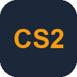

# Features

## General features in all supported games

- One-click install/update
- Start/monitor/stop game server
- Host LAN only/public game server
- Tabbed config windows for common settings with tooltips explaining them
- Show all available maps and allow them to be used by name
    - Define server name, password, listen address and port, ...
    - Server tickrate
    - Password protect your game server
    - Create map groups
    - Optional map vote
    - Optional bots
    - RCON
    - Automatic/manual config save in toml config file
- Extend existing config options by defining custom pre and post options when starting game server
- Further extend config options by writing your own config files which are appended to existing ones
- If your run into any problems, an error report can be created and attached to a github issue
- A button takes you to the sgsl github page
- Automatically check for sgsl updates
- Terminal window showing all sgsl and game server output

## Game-specific features

###  Counter-Strike 2

- Host workshop maps and include them in your own map groups
- Host workshop map groups (collections)
- Steam GSLT and API auth key fields for workshop hosting / server browser listing.
- Troubleshooting: clear stale app manifest, toggle steamcmd self-update.

###  Counter-Strike: Global Offensive

- Automatic handling of csgo re-release quirks (app ID handling)
- Host workshop maps and include them in your own map groups
- Host workshop map groups (collections)
- Steam GSLT and API auth key fields for workshop hosting / server browser listing.
- Troubleshooting: clear stale app manifest, toggle steamcmd self-update.

###  Venice Unleashed

- Mod support with configurable per mod on/off and URL
    - Fun Bots
    - N4gi0s/Venice Unleashed MapVote
