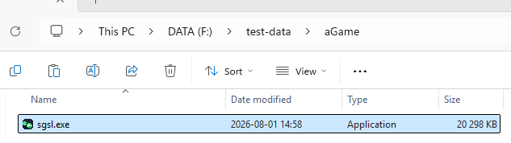
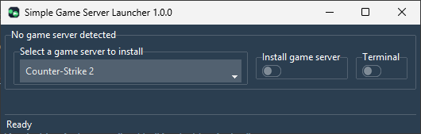
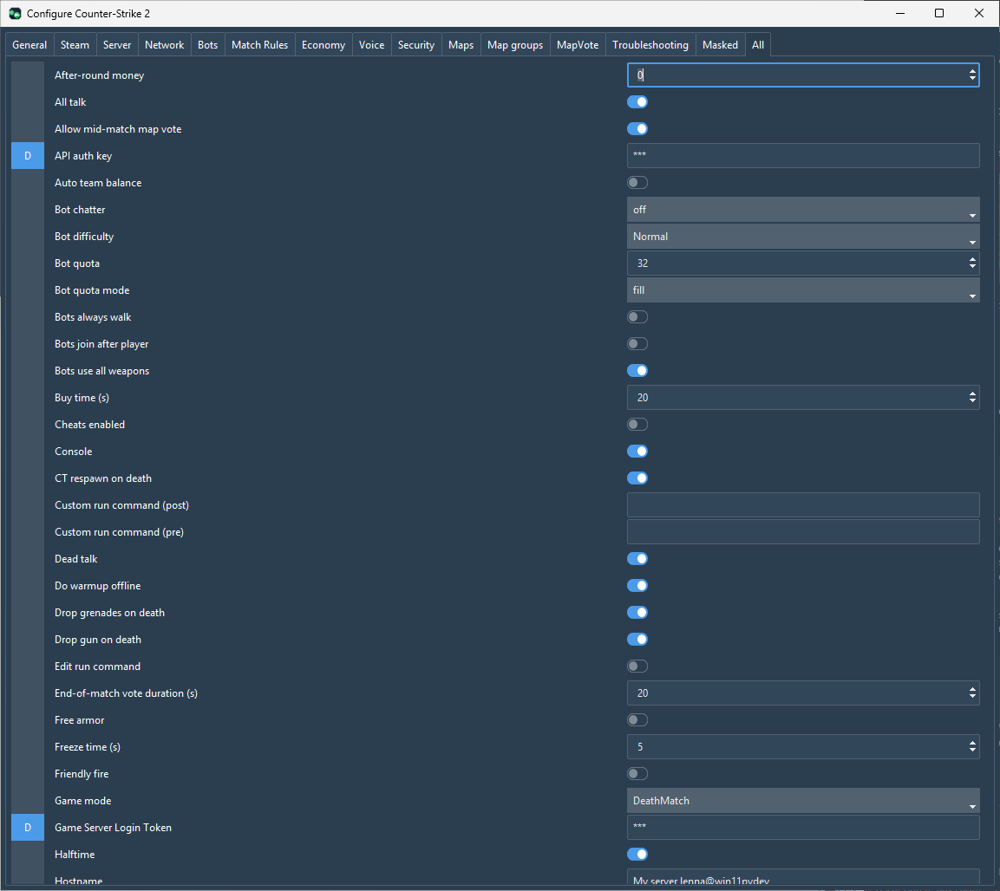
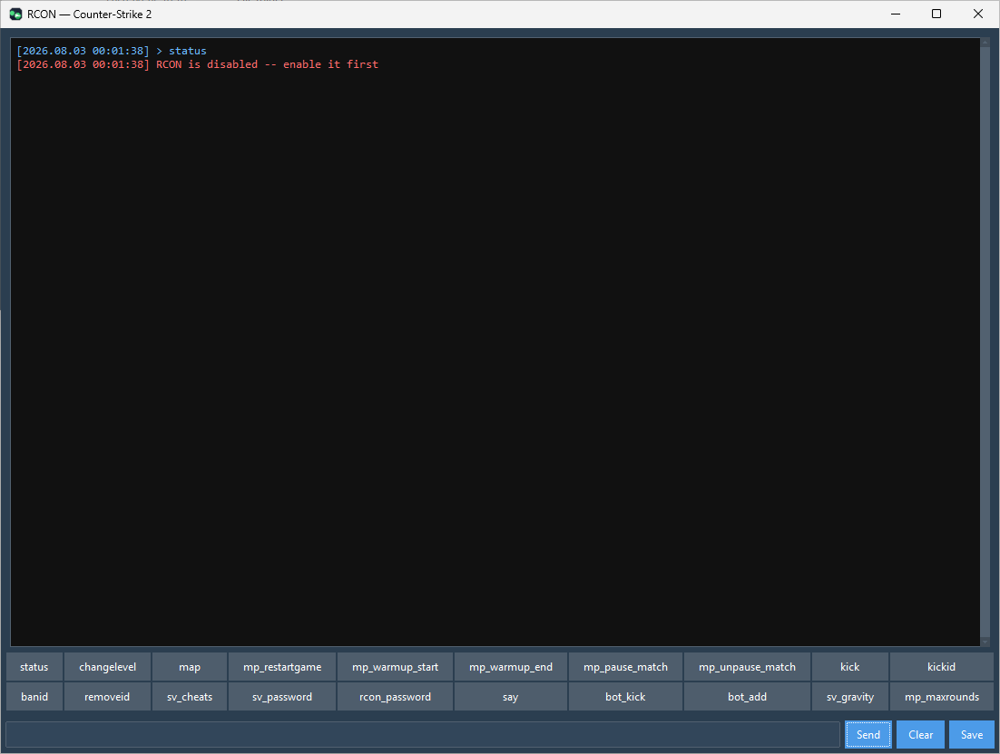
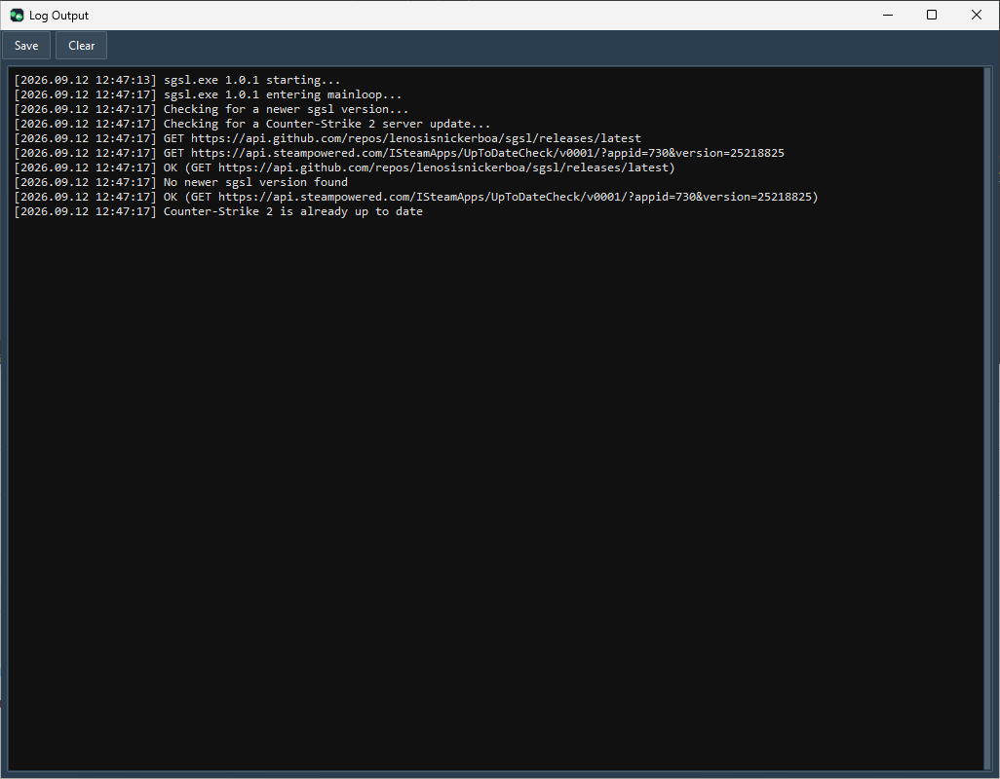

# Features

## General features in all supported games

- One-click install/update (start server possible without any further configuration)
- Start/monitor/stop game server
- Host LAN only/public game server
- Multiple game servers per host (you need to avoid port collisions of course)
- Tabbed config windows for common settings with tooltips explaining them
    - Similar config tabs over all applications
    - A "Masked" tab containing all secrets (password/keys/...)
    - An "All" tab containing all available config options
- Default config item handling gor global, per config tab or config item.
- Show all available maps and allow them to be used by name
    - Define server name, password, listen address and port, ...
    - Server tickrate
    - Password protect your game server
    - Create map groups
    - Optional map vote
    - Optional bots
    - RCON server config
    - Automatic/manual config save in toml config file
- RCON client (connects to game server using server config)
- Extend existing config options by defining custom pre and post options when starting game server
- Further extend config options by writing your own config files which are appended to existing ones
- If your run into any problems, an error report can be created and attached to a github issue
- A button takes you to the sgsl github page
- Automatically check for sgsl updates
- Terminal window showing all sgsl and game server output
- Main window and all other windows snap to each other (configurable)

## Game-specific features

###  Counter-Strike 2

- Host workshop maps and include them in your own map groups
- Host workshop map groups (collections)
- Steam GSLT and API auth key fields for workshop hosting / server browser listing.
- Troubleshooting: clear stale app manifest, toggle steamcmd self-update.

###  Counter-Strike: Global Offensive

- Automatic handling of csgo re-release quirks (app ID handling)
- Host workshop maps and include them in your own map groups
- Host workshop map groups (collections)
- Steam GSLT and API auth key fields for workshop hosting / server browser listing.
- Troubleshooting: clear stale app manifest, toggle steamcmd self-update.

###  Venice Unleashed

- Mod support with configurable per mod on/off and URL
    - Fun Bots
    - N4gi0s/Venice Unleashed MapVote (patched with BF3-Mods-Votemap)
    - VU-More-Gore
    - Head-hit-sounds-effect

## Install/Update

Create a directory, download sgsl.exe into it.

Start sgsl.exe

Select the game to install.

Select "Install game server". By default a terminal window is shown during install, close it if you like. After some time, a dialog box will state that installation is finished and that the application will restart after which you will be presented with the window below.

The game will be installed into a directory "server".

## The main window

The main window is organized in a game server part where you control the game server. It can be started by clicking the Start button. If the game server is successfully started the button will change to Stop. If the game server crashes for some reason you will get a dialog box with a message stating this and the button will once again become a Start button.
There is also a button taking you to the developers home page.

Then there are some shortcut buttons for convenience.

And finally some application buttons.

Hover over anything to get a tooltip explaining more.

## Config

This is the typical layout of the config window. A tab for each group of parameters and an "All" tab to the far right containing all parameters in alphabetical order.

Config is automatically updated as you edit it, and is used directly when you start your server. There's also a manual "Save Config" button if you want to force the configuration to be saved to file. The configuration is automatically saved to file when you close the application, so it's really only necessary should you perform a large edit and the application crashes before you close it.

## RCON

There is also an RCON window where the started server can be controlled. The RCON window contents can be saved to a file by clicking the Save button. The RCON window output will be saved in a directory "rcon_output" in the install directory.

## Terminal

There is also a terminal window where all sgsl actions will end up, as well as any output from the game server. The terminal contents can be saved to a file by clicking the Save button. The terminal output will be saved in a directory "terminal_output" in the install directory.

## Error report

There's a button for generating an error report, which is just a zip archive containing information which is useful when reporting an [issue](https://github.com/lenosisnickerboa/sgsl/issues/). Since this archive will, among other things, contain all config it is a good idea to browse through it to ensure nothing sensitive is included. I have tried my very best not to include any sensitive information, all passwords and keys should be masked, but you never know. The error report will be saved in a directory "error_reports" in the install directory.

Should the installation fail, an error report is automatically generated for you.

