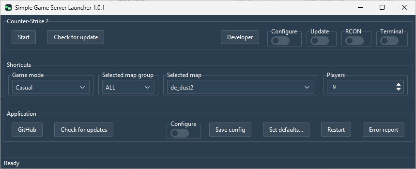

# sgsl

Simple Game Server Launcher

  — [detailed download stats](https://somsubhra.github.io/github-release-stats/?username=lenosisnickerboa&repository=sgsl)

# The general idea - "One click install game server"

This is a simple game server launcher suitable for people wanting to quickly setup and host a game server for some friends without diving into all the details.

Create an empty directory for your server, download sgsl.exe into it and start it, select game to install. Done. (Note that installing a game may take a while and will not produce continous output during the install. Just sit back and enjoy and let it finish.)

Currently supported games:
-  [Counter-Strike 2](src/game/cs2/README.md)
-  [Counter-Strike: Global Offensive](src/game/csgo/README.md)
-  [Venice Unleashed](src/game/vu/README.md)

# Features

See [FEATURES.md](FEATURES.md) for the full list of what sgsl can do, both in general and per supported game.

# Preconditions

For now requires Windows 11. It probably works on previous Windows versions but I haven't tested it.

If a linux version is in high demand I will consider porting it to linux. sgsl is mostly python but there are some linux only things to consider when dealing with the actual game servers. So, I will be collecting requests for a while before starting this journey. Also, please state the linux distribution.

# Firewalls

The first time you start your server you will get questions from the Windows firewall. Simply accept all questions to allow access to your game server.

# Customization

The application and the installed game can both be configured. The application config deals with general options for all games and the game specific part deals with the selected game.

On top of this config there are also ways for the more advanced user to further fine tune the game config:

1. In the 'General' config tab of your game, select 'Edit run command' which will let you edit the command before it is used to start the game server. This edit will only apply to this game server start.
1. In the 'General' config tab of your game, there are options 'Custom run command (pre)' and 'Custom run command (post)' where you can add any options you want prepended or appended to the command line every time the server starts.
1. You can write game specific config files named and have them automatically appended to the installed game when starting it. Read more in the game specific README.md.

# Known limitations

The csgo implementation is mostly there for you to test. csgo was re-released in 2026 but I'm having a hard time getting it to work. I release the csgo support as is and hopefully someone can figure out how best to add support for this game.

# Troubleshooting

As a a first hint, if something doesn't work, have a look in the terminal log to see more details of what failed. There is also the possibility to create an error report and file an [issue](https://github.com/lenosisnickerboa/sgsl/issues). I will do my best to analyze it. As always, the more time you put into the issue text, the less time I need to fix the issue.

**I have done my best to mask all sensitive data in the error report, but please inspect the complete report before submitting it to ensure nothing sensitive is leaked.**

## Developer information

If you want to develop sgsl on your own, [here](src/develop/README.md) are some hints.

# Some notes on my setup

I am currently only running local game servers and invite external players via the free [tailscale](https://tailscale.com/) but there is nothing stopping you from going public with your server. I have provided the necessary options and briefly described what is required in the game descriptions. 

I have a limited amount of people connecting to my servers and hence I find tailscale a simple and practical solution for this. I have a dedicated PC running as a game server host machine with tailscale providing access the the entire host. I invite external users via tailscale and once connected they can access any game server I host as if they were connected directly to my LAN.

# A few words about the application, myself and AI

This application is mostly written in python, a language I have used from time to time but far from master. I have written this application as a hobby project since I wanted to play with python and occasionaly host game servers for connecting friends. I just want an easy way to host game servers and to offer others the same level of hosting I am content with. This is the game server launcher for dummies, but it also offers quite a bit of custom configuration should you want it. If you're an expert tinkerer this is probably not the application for you.

Also, a few words on AI, as it tends to be a popular topic right now (31 of July, 2026). I have designed the program structure, coded most of the basics from scratch and I have quite extensively used Claude to further improve functionality. Claude has many times surpassed my expectations, but also underperformed. I take full responsibility for the code though. I have reviewed and approved all Claude's changes. Just wanted to get that out of the way in case someone has strong opinions on "vibe coding". If it's not for you, just don't use sgls. And while you're at it, stop googling and copy-pasting from stack overflow...